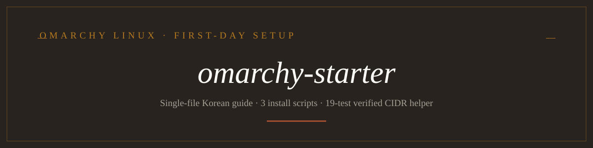

<p align="center">
  
</p>

<p align="center">
  <strong>Omarchy Linux 첫날을 위한 현장 안내서, 한국어와 영어 —<br>
  체크리스트 설치기 하나, 그리고 모든 장이 초보자 명령어와 AI 에이전트용 복사 프롬프트를 함께 제공합니다.</strong>
</p>

<p align="center">
  <a href="tests/"></a>
  <a href="omarchy-starter.html"></a>
  
</p>

<!-- README-I18N:START -->

[English](./README.md) | **한국어**

<!-- README-I18N:END -->

**omarchy-starter**는 [Omarchy](https://omarchy.org) Linux 초보자를 위한 설치 안내서로, 언어별 단일 HTML 파일 하나 — `omarchy-starter.html`(한국어)과 `omarchy-starter.en.html`(영어) — 로 배포됩니다. 스크린샷을 내장하고 빌드 과정이 없어 [GitHub Pages](https://yelixir-dev.github.io/omarchy-starter/omarchy-starter.html)에서 바로 읽거나 파일 하나만 내려받아 열 수 있습니다. 여섯 개의 장에서 설치 전 확인, AI 코딩 에이전트(OMO, 선택), 한국어 입력기(Fcitx5, 필수), 2019년 이하 Intel Mac 팜 리젝션, Tailscale과 NordVPN 함께 쓰기, 카카오톡과 Mac식 스크린샷을 다룹니다. 체크리스트 설치기 `install.sh`가 같은 작업을 터미널 화면 하나에서 해 줍니다. Omarchy 4.0.2에서 검증했고, 작성 시점의 최신 릴리스는 4.0.4입니다.

[무엇을 하나요](#무엇을-하나요) · [설치](#설치) · [사용법](#사용법) · [동작 방식](#동작-방식) · [저장소 구성](#저장소-구성) · [현재 한계](#현재-한계) · [참고와 감사](#참고와-감사) · [라이선스](#라이선스)

## 무엇을 하나요

- **언어별 파일 하나가 안내서 전부입니다.** 두 HTML 파일 모두 스크린샷을 data URI로 내장해서, 파일 하나(또는 Pages 링크)만 전달해도 문서 전체가 열립니다. 서로 링크로 이어집니다.
- **모든 장이 같은 세 블록을 따릅니다.** 쉬운 말 설명, 직접 실행할 Omarchy 명령, 그리고 초보자가 AI 코딩 에이전트에 붙여 넣어 대신 시킬 수 있는 "AI에게 맡기기" 프롬프트입니다.
- **체크리스트 하나로 모두 설치합니다.** `install.sh`가 이미 설치된 것을 확인한 뒤 4가지 상태 목록 — `[v]` 설치, `[-]` 유지, `[x]` 제거, `[ ]` 선택 안 함 — 을 띄우고, 커서가 가리키는 항목의 설명을 화면에 보여줍니다. 설치된 항목은 `[-]`, 미설치 필수·권장 항목은 `[v]`로 시작합니다. 기본은 한국어 화면이고 `--lang en`이면 영어입니다.
- **항목 15개가 각각 하나의 단계입니다.** 필수: 시스템 업데이트, 한글 입력(`fcitx5-hangul`), nano 기본 에디터. 권장: bun으로 설치하는 OMO 에이전트, 한/영 키 설정(오른쪽 Alt를 한/영 키로, Super+Space 메뉴는 영문으로), 상태바 K/E 표시, Mac식 스크린샷 키, 비밀번호 관리자. 선택: Intel Mac 팜 리젝션, 카카오톡(Bottles 또는 Wine AUR 패키지), Tailscale, VPN 상태바 토글, 브라우저, Syncthing, 개발자 셸 도구.
- **스크립트 8개는 단독으로도 동작합니다.** `install-fcitx5-hangul.sh`, `install-fcitx5-bar-indicator.sh`, `install-screenshot-shortcuts.sh`, `install-vpn-bar-toggles.sh`, `install-kakaotalk-bottles.sh`, `patch-kakaotalk-korean-input.sh`, `install-intel-mac-palm-rejection.sh`(`--dry-run`, `--uninstall` 지원), `manage-vpn-bypass-routes.sh`이며, 설치기의 단계가 이 스크립트를 호출합니다.
- **VPN 장은 검증된 공존 구성을 문서화합니다.** Tailscale 메시와 NetworkManager OpenVPN 프로필을 함께 쓰며, 피어 경로는 Tailscale의 table 52에 남고 나머지 트래픽은 Nord로 갑니다. 의도적으로 fail-open이며 kill switch는 없습니다.
- **스크립트는 회귀 테스트를 거쳤습니다.** `tests/`가 35개 검사를 실행합니다: CIDR 도구(19개, 실제 네트워크 네임스페이스 테스트 포함), 카카오톡 글꼴 패치(3개), 설치기(13개: 상태 순환, 계획 출력, 실행 순서, 언어 키 일치, 가짜 홈에서 nano와 한/영 키 단계).

## 설치

새 Omarchy 터미널에서 체크리스트를 실행하세요(저장소를 `~/.local/share/omarchy-starter`에 clone 합니다):

```bash
curl -fsSL https://raw.githubusercontent.com/yelixir-dev/omarchy-starter/main/install.sh | bash
```

영어 화면으로 쓰려면:

```bash
curl -fsSL https://raw.githubusercontent.com/yelixir-dev/omarchy-starter/main/install.sh | bash -s -- --lang en
```

직접 clone 해서 스크립트를 하나씩 실행할 수도 있습니다:

```bash
git clone https://github.com/yelixir-dev/omarchy-starter.git
cd omarchy-starter
./install.sh            # the checklist
./install-fcitx5-hangul.sh   # or any single script
```

스크립트는 Omarchy/Arch Linux를 대상으로 하며 시스템을 건드리는 곳에서 sudo를 요청합니다.

## 사용법

안내서를 열고 장 순서대로 따라가세요:

```bash
xdg-open omarchy-starter.html        # or open https://yelixir-dev.github.io/omarchy-starter/omarchy-starter.html
```

체크리스트에서는 `↑↓`로 이동, `Space`로 상태 변경, `Enter`로 실행, `q`로 종료합니다. 화면 없이 쓰는 방법:

```bash
./install.sh --list                          # every item with its status and default action
./install.sh --dry-run --only korean,nano    # print the plan, run nothing
./install.sh --remove screenshots            # undo one item
./install.sh --all --choice password=bitwarden
```

각 "AI에게 맡기기" 블록은 완성된 프롬프트입니다. 한글 입력기 장의 예시:

```text
내 컴퓨터는 Omarchy(Arch Linux)야.
https://github.com/yelixir-dev/omarchy-starter 저장소를 clone 받고, 그 안의
install-fcitx5-hangul.sh 스크립트로 Fcitx5 한글 입력기를 설치해줘.
```

내 장비에서 도구를 검증하려면 테스트를 실행하세요:

```bash
bash tests/test-manage-vpn-bypass-routes.sh    # 19 tests, last line prints 1..19
bash tests/test-kakaotalk-korean-fonts.sh      # 3 tests
bash tests/test-installer.sh                   # 13 tests
```

## 동작 방식

1. 안내서는 위에서 아래로 읽습니다: 설치 전 확인 → OMO(선택) → 한글 입력기(필수) → 팜 리젝션(Intel Mac만) → VPN → 카카오톡과 스크린샷.
2. 각 장은 쉬운 말로 무엇을 왜 하는지 설명한 뒤 번호가 붙은 직접 명령으로 이어집니다.
3. `install.sh`는 `steps/*.sh`를 파일 이름 순서로 읽습니다. 각 단계는 `installed`, `outdated`, `missing` 중 하나를 보고하고 `install`과 `remove`를 구현합니다. 제거가 먼저 역순으로, 설치가 그다음 순서대로 실행되며, 한 항목이 실패해도 나머지는 계속합니다.
4. 스크립트는 멱등입니다: 바꾸기 전에 기존 상태를 백업하고, 사용자 파일에 추가하는 줄은 모두 표시 주석으로 감싸며, 안전하지 않은 대상은 거부합니다.
5. VPN 경로는 Tailscale을 먼저 설치하고(`--accept-routes=false`, exit node 없음), NordVPN은 자동 연결을 끈 NetworkManager OpenVPN 프로필로만 설치합니다.
6. 각 장의 마지막은 검증 명령으로 닫습니다 — 공인 IP 확인, `tailscale ping`, table 52 경로 조회, 테스트 스위트입니다.

## 저장소 구성

```text
omarchy-starter.html                    the Korean single-file guide (images embedded)
omarchy-starter.en.html                 the English single-file guide
index.html                              Pages redirect to the Korean guide
install.sh                              checklist installer (clone/pull, probe, four-state list, run)
lib/common.sh, lib/ui.sh                shared helpers and the /dev/tty checklist
i18n/ko.sh, i18n/en.sh                  every UI string, item name and description
steps/NN-<id>.sh                        one file per item: status / install / remove
install-fcitx5-hangul.sh                Fcitx5 Korean input installer
install-fcitx5-bar-indicator.sh         bar K/E input-language indicator installer
install-screenshot-shortcuts.sh         Mac-style screenshot keys + bar capture button
install-vpn-bar-toggles.sh              installs only the VPN bar toggles you have
install-kakaotalk-bottles.sh            KakaoTalk on Bottles (Flatpak) installer
patch-kakaotalk-korean-input.sh         Korean font patch for the KakaoTalk bottle
install-intel-mac-palm-rejection.sh     Intel Mac trackpad classification fix
manage-vpn-bypass-routes.sh             non-Tailscale CIDR bypass manager
vpn-bypass-routes.conf.example          sample bypass list for the manager
tests/                                  35 regression checks across three suites
assets/                                 bar screenshots embedded in the guide
DESIGN.md                               design contract for the guide
```

## 현재 한계

- 명령어는 Omarchy/Arch Linux(`omarchy pkg`, `pacman`)를 기준으로 하며 다른 배포판은 범위 밖입니다.
- 카카오톡 Wine 경로는 커뮤니티 AUR 패키지 `kakaotalk`을 설치합니다. 내용은 검토했지만 Omarchy에서 직접 실행해 보지는 않아 설치기에서 실험적으로 표시합니다. 검증된 경로는 Bottles입니다.
- VPN 조합은 의도적으로 fail-open(kill switch 없음)이며, Nord 프로필의 절전 복귀와 재부팅 후 유지는 테스트하지 않았고 보장하지 않습니다.
- 팜 리젝션 스크립트는 `MacBookAir8,2`에서 검증했으며, 다른 모델은 `--dry-run`부터 시작해야 합니다.
- 체크리스트는 물어볼 터미널이 필요합니다. CI나 스크립트에서는 `--all`, `--only`, `--remove`를 쓰세요.

## 참고와 감사

- 키 매핑과 설치기 안전 규칙의 아이디어(오른쪽 Alt를 한글 키로, 메뉴를 영문 입력으로 열기, 고정 실행 순서, 터미널 없이는 추측하지 않기)는 [minsoft1115/omarchy-setup](https://github.com/minsoft1115/omarchy-setup)에서 가져와 여기서 직접 구현했습니다.
- 안내서의 외관은 [yelixir.dev](https://yelixir.dev)를 따르며, 글꼴(Space Grotesk, DM Sans, Instrument Serif, JetBrains Mono)은 SIL Open Font License로 사용합니다.

## 라이선스

to be declared

---

<p align="center"><em>omarchy-starter — Omarchy Linux 첫날을 위한 현장 안내서.</em></p>
